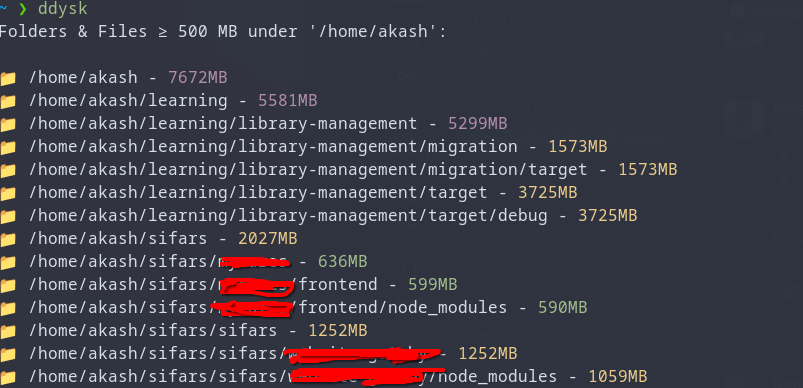
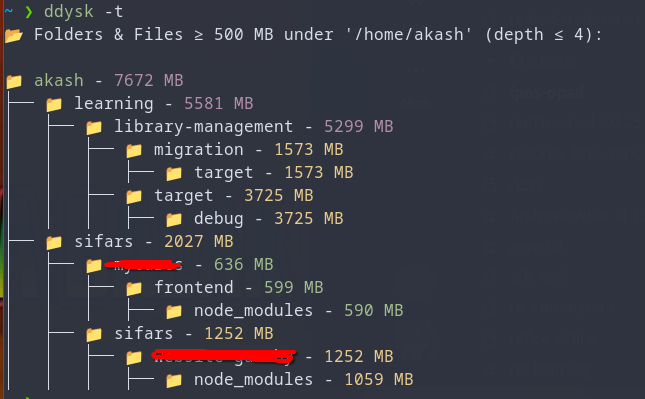

# ddysk

A bash script to visualize large directories and files in a tree-like structure. `ddysk` helps you quickly identify what's taking up space on your disk by scanning directories and displaying folders and files above a specified size threshold.

## Screenshots

### Simple List Format


### Tree Format


## Features

- 🔍 Find large folders and files recursively
- 📊 Display results in tree format or simple list format
- ⚙️ Configurable minimum size threshold
- 🎯 Configurable maximum search depth
- 👁️ Optional exclusion of hidden files and directories
- 📁 Shows both folder sizes and individual large files

## Requirements

- Bash shell
- Standard Unix utilities: `find`, `du`, `sort`, `awk`

## Installation

### Local Installation

1. Clone or download this repository
2. Make the script executable:
   ```bash
   chmod +x ddysk
   ```

### Global Installation

To make `ddysk` available globally from anywhere in your terminal:

**Option 1: Copy to system directory (requires sudo)**
```bash
sudo cp ddysk /usr/local/bin/
sudo chmod +x /usr/local/bin/ddysk
```

**Option 2: Copy to user directory (no sudo required)**
```bash
mkdir -p ~/.local/bin
cp ddysk ~/.local/bin/
chmod +x ~/.local/bin/ddysk
```

Then add `~/.local/bin` to your PATH if it's not already there. Add this line to your `~/.bashrc` or `~/.zshrc`:
```bash
export PATH="$HOME/.local/bin:$PATH"
```

**Option 3: Create a symlink (requires sudo)**
```bash
sudo ln -s $(pwd)/ddysk /usr/local/bin/ddysk
```

After installation, you can use `ddysk` from any directory:
```bash
ddysk -p /home/user -s 100
```

## Usage

If installed globally:
```bash
ddysk [OPTIONS]
```

If using locally:
```bash
./ddysk [OPTIONS]
```

### Options

- `-p, --path PATH` - Starting path to search (default: current directory `.`)
- `-s, --size SIZE` - Minimum size in MB (default: 500)
- `--exclude-hidden` - Exclude hidden files and folders (default: included)
- `-t, --tree` - Display results in tree format (default: simple list)
- `-h, --help` - Show help message

### Examples

Scan current directory for items ≥ 500MB (simple list format):
```bash
ddysk
```

Scan a specific directory for items ≥ 100MB in tree format:
```bash
ddysk -p /home/user -s 100 -t
```

Scan current directory for items ≥ 50MB (excluding hidden files):
```bash
ddysk -s 50 --exclude-hidden
```

Scan with all options enabled:
```bash
ddysk -p . -s 200 --exclude-hidden -t
```

## Output Format

The script supports two output formats:

### Simple List Format (default)
- Each entry shows the full path and size in MB
- Format: `icon path - sizeMB`
- Icons are color-coded: green for folders, blue for files
- Sizes are color-coded: green (< 1GB), yellow (1-5GB), magenta (5-10GB), red (> 10GB)

### Tree Format (`-t` or `--tree`)
- Displays results in a hierarchical tree structure
- 📁 Folders are marked with a folder icon (green)
- 📄 Files are marked with a file icon (blue)
- Each entry shows the name and size in MB
- Tree characters (`│`, `├──`) indicate the directory hierarchy
- Sizes are color-coded: green (< 1GB), yellow (1-5GB), magenta (5-10GB), red (> 10GB)

## Notes

- Hidden files and directories (starting with `.`) are included by default; use `--exclude-hidden` to exclude them
- The script uses temporary files in `/tmp` for sorting
- Folder sizes represent the total size including all contents
- The default output format is a simple list; use `-t` or `--tree` for tree format